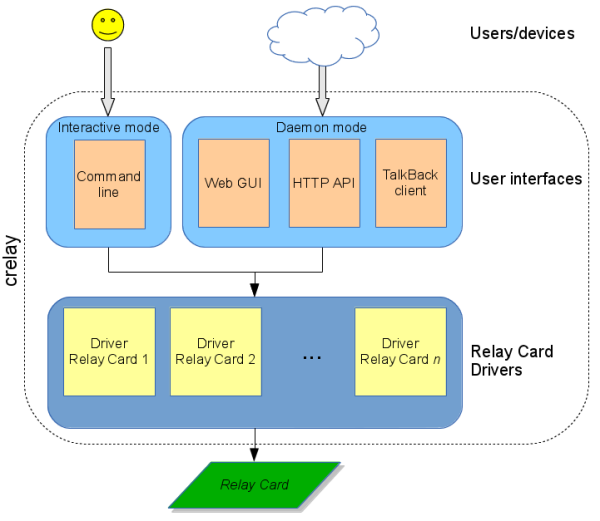
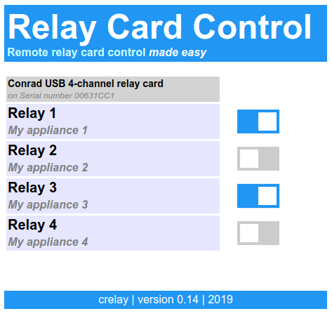
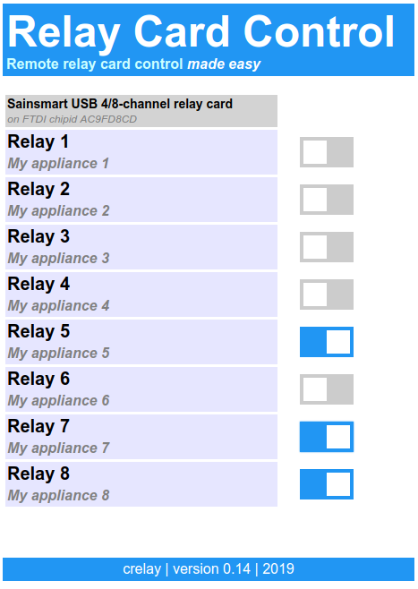

# crelay
#### Controlling different relay cards for home automation with a Linux software

### About  
Ever bougth a cute little USB relay card and wanted to use it on a Linux based device or computer? Chances are that your were out of luck because the Linux software support for the card provided by the manufacturer was non existent. Conrad, Sainsmart, Denkovi and friends are still ignoring the existence of this operating system. That's why I started this project.  

This software is intended to run on Linux systems to control USB relay cards from different manufacturers in a unified way. It provides several interfaces for controlling the relays locally or remotely via the network. The relays can be controlled by a human being via a device like smartphone or web browser, or directly by an intelligent device as used in the Internet of Things.  
The software was designed with the following requirements in mind:  

 - simple, intuitive usage and interface
 - as little dependencies as possible (libraries, drivers, external programs)
 - runs on a variety of Linux distributions, different hardware platforms
 - lightweight, can run on simple devices
 - easily expandable (adding relay card types and user interfaces)

New relay cards support can be added by providing the cards driver code for detecting the card, reading and setting the relays.
Currently the following relay cards are supported:  

- [Conrad USB 4-channel relay card](http://www.conrad.de/ce/de/product/393905), 
  see [*Note 1*](https://github.com/ondrej1024/crelay#note-1-conrad-usb-4-channel-relay-card) below
- [Sainsmart USB 4/8-channel relay card](http://www.sainsmart.com/sainsmart-4-channel-5v-usb-relay-board-module-controller-for-automation-robotics.html), 
  see [*Note 2*](https://github.com/ondrej1024/crelay#note-2-sainsmart-usb-48-channel-relay-card) below
- [HID API compatible relay cards (1/2/4/8 channel)](http://www.ebay.com/itm/For-Smart-Home-5V-USB-Relay-2-Channel-Programmable-Computer-Control-/190950124351)
- [Sainsmart USB 16-channel relay control module](http://www.sainsmart.com/arduino/sainsmart-16-channel-controller-usb-hid-programmable-control-relay-module.html)
- Generic GPIO controlled relays, 
  see [*Note 3*](https://github.com/ondrej1024/crelay#note-3-gpio-controlled-relays) below  

The used relay card is automatically detected. No complicated port or communication parameter settings required. Just plug in your card and play.  

The following picture shows a high level view on the modular software architecture.  

  

### Features
- Command line mode and daemon mode with Web GUI
- Automatic detection of relay card
- Reading of current relay states
- Setting of new relay states
- Single pulse generation on relay contact
- HTTP API for external clients (e.g. Smartphone/tablet apps)
- Multiple relay card type support
- Support for configuration file with custom parameters
- Multiple cards support (command line interface only)
 

### Nice to have (wishlist)
- Integrated MQTT client
- [ThingSpeak Talkback App](https://thingspeak.com/docs/talkback)
- Multiple cards support (Web UI / REST API)
- Access control for Web GUI and HTTP API
- Programmable timers for relay actions  
 

### Screenshots

#### Web GUI

 
----------

  

#### Command line interface
    $ crelay 
    crelay, version 0.13
    
    This utility provides a unified way of controlling different types of relay cards.
    Currently supported relay cards:
      - Conrad USB 4-channel relay card
      - Sainsmart USB 4/8-channel relay card
      - HID API compatible relay card
      - Sainsmart USB-HID 16-channel relay card
      - Generic GPIO relays
    The card which is detected first will be used, unless -s switch and a serial number is passed.
    
    The program can be run in interactive (command line) mode or in daemon mode with
    built-in web server.

    Interactive mode:
        crelay [-s <serial number>] -i | [<relay number>] [ON|OFF]

           The state of any relay can be read or it can be changed to a new state.
           If only the relay number is provided then the current state is returned,
           otherwise the relays state is set to the new value provided as second parameter.
           The USB communication port is auto detected. The first compatible device
           found will be used, unless -s switch and a serial number is passed.

    Daemon mode:
        crelay -d [<relay1_label> [<relay2_label> [<relay3_label> [<relay4_label>]]]] 
    
           In daemon mode the built-in web server will be started and the relays
           can be completely controlled via a Web browser GUI or HTTP API.
           Optionally a personal label for each relay can be supplied which will
           be displayed next to the relay name on the web page.
    
           To access the web interface point your Web browser to the following address:
           http://<my-ip-address>:8000
    
           To use the HTTP API send a POST or GET request from the client to this URL:
           http://<my-ip-address>:8000/gpio
   

### HTTP API
An HTTP API is provided to access the server from external clients. This API is compatible with the PiRelay Android app. Therefore the app can be used on your Android phone to control *crelay* remotely.  
   
Note: *the author of this app seems to have removed the free version of the app from the Google Play Store (leaving only the PRO version).
For this reason and the fact that PiRelay is not open source I am considering to develop a dedicated crelay Android app. This will use a more universal Json format based API. Any volunteers who want to contribute to this app are very welcome.*

- API url:  
<pre><i>ip_address[:port]</i>/gpio</pre>  

- Method:  
<pre>POST or GET</pre>  

- Reading relay states  
Required Parameter: none  

- Setting relay state  
Required Parameter: <pre>pin=[1|2|3|4], status=[0|1|2] where 0=off 1=on 2=pulse</pre>  

- Response from server:  
<pre>
Relay 1:[0|1]
Relay 2:[0|1]
Relay 3:[0|1]
Relay 4:[0|1]
</pre>  
 

### Installation from source
The installation procedure is usually perfomed directly on the target system. Therefore a C compiler and friends should already be installed. Otherwise a cross compilation environment needs to be setup on a PC (this is not described here).  

* Install dependencies (package names may vary depending on your distribution):

If you have a Debian, Ubuntu or derivative distribution:
<pre>
    apt-get install libftdi1 libftdi-dev libhidapi-libusb0 libhidapi-dev libusb-1.0-0 libusb-1.0-0-dev
</pre>

If you have OpenSUSE or a derivative distribution:
<pre>
    zypper install libftdi1-devel libftdi0-devel libhidapi-libusb0 libhidapi-devel libusb-1_0-devel libusb-1_0-0 libftdi1 libftdi1-2
</pre>

* Build dependencies from source (optional):  
On some not so recent Linux distributions (like Debian Weezy) the HIDAPI library is not yet packaged, so it needs to be build from the source code. Follow these instructions to do that:
<pre>
    apt-get install libudev-dev libusb-1.0-0-dev
    git clone git://github.com/signal11/hidapi.git
    ./bootstrap
    ./configure
    make
    sudo make install
</pre>

* Clone crelay git repository :  
<pre>
    git clone https://github.com/ondrej1024/crelay
    cd crelay
</pre>

* Alternatively get latest source code version :  
<pre>
    wget https://github.com/ondrej1024/crelay/archive/master.zip
    unzip master.zip
    cd crelay-master
</pre>

* Build and install :  
<pre>
    cd src
    make [DRV_CONRAD=n] [DRV_SAINSMART=n] [DRV_HIDAPI=n]
    sudo make install
</pre>
<i>Note:</i> Optionally, you can exclude specific relay card drivers (and their dependencies) from the build, if you don't need them. To do this, specify the driver name as parameter of the "make" command as shown above.  

 

### Installation of prebuilt binaries
To save you the hassle of building crelay from source, prebuild binaries are provided for selected architectures. Just save the binary for your architecture on your host system and execute it.  

The binaries can be downloaded from the [Latest release page](https://github.com/ondrej1024/crelay/releases/latest).

<i>Note:</i> The binaries use shared librabries, so you might need to install the needed libs to your system, if not already done previously:  
<pre>
    apt-get install libftdi1 libhidapi-libusb0 libusb-1.0-0
</pre>  

 

### Distribution specific packages
Currently, there are official OpenWRT packages available for different architectures from the developement snapshot repositories. They can be downloaded here:  

    https://downloads.openwrt.org/snapshots/trunk/[arch]/generic/packages/packages/crelay<ver>_<arch>.ipk

If anyone wants to build packages for other Linux distributions, please feel free to do so and share it here.  

 

### Configuration
When running in daemon mode. the parameters for *crelay* can be customized via the configuration file `crelay.conf` which should be placed in the `/etc/` system folder. An example file is provided together with the programs source code in the `conf/` folder.

<pre>
################################################
#
# crelay config file
#
# This file is read by crelay in daemon mode
# from /etc/crelay.conf
#
################################################

# HTTP server parameters
################################################
[HTTP server]
server_iface = 0.0.0.0    # listen interface IP address
#server_iface = 127.0.0.1 # to listen on localhost only
server_port  = 8000       # listen port
relay1_label = Device 1   # label for relay 1
relay2_label = Device 2   # label for relay 2
relay3_label = Device 3   # label for relay 3
relay4_label = Device 4   # label for relay 4
relay5_label = Device 5   # label for relay 5
relay6_label = Device 6   # label for relay 6
relay7_label = Device 7   # label for relay 7
relay8_label = Device 8   # label for relay 8
    
# GPIO driver parameters
################################################
[GPIO drv]
#num_relays = 8    # Number of GPIOs connected to relays (1 to 8)
#active_value = 1       # 1: active high, 0 active low
#relay1_gpio_pin = 17   # GPIO pin for relay 1 (17 for RPi GPIO0)
#relay2_gpio_pin = 18   # GPIO pin for relay 2 (18 for RPi GPIO1)
#relay3_gpio_pin = 27   # GPIO pin for relay 3 (27 for RPi GPIO2)
#relay4_gpio_pin = 22   # GPIO pin for relay 4 (22 for RPi GPIO3)
#relay5_gpio_pin = 23   # GPIO pin for relay 5 (23 for RPi GPIO4)
#relay6_gpio_pin = 24   # GPIO pin for relay 6 (24 for RPi GPIO5)
#relay7_gpio_pin = 25   # GPIO pin for relay 7 (25 for RPi GPIO6)
#relay8_gpio_pin = 4    # GPIO pin for relay 8 ( 4 for RPi GPIO7)
    
# Sainsmart driver parameters
################################################
[Sainsmart drv]
num_relays = 4   # Number of relays on the Sainsmart card (4 or 8)
</pre>

 
  
### Adding new relay card drivers
The modular architecture of *crelay* makes it possible to easily add new relay card drivers.  
See example files `relay_drv_sample.c` and `relay_drv_sample.h` in the src directory for details on how to write your own low level driver functions.  
   

### Credits
The support for the different relay cards in *crelay* has only been possible thanks to the valuable contributions of the following people who reverse engineered the communication protocols of the cards and provided the protocol specifications.

* [Dominic Sacré](https://github.com/dsacre) who discovered the communication protocol of the Conrad USB card
* [Darryl Bond](https://github.com/darrylb123), who discovered the communication protocol of the HID API cards
* [Steve Crow](https://github.com/stav09), who discovered the communication protocol of the Sainsmart USB cards
* [Kevin Hilman](https://github.com/khilman), who implemented and tested the support for the Sainsmart 16-channel control module
* [Andrew Lunn](https://github.com/lunn), who contributed cleanup patches
* [Andrey Shevtsov](https://github.com/sqlwristband), who contributed the initial multiple cards implementation
* [Alberto Bursi](https://github.com/bobafetthotmail), who contributed documentation for OpenSUSE build support
* [Derek Atkins](https://github.com/derekatkins), who contributed multiple cards handling for the Sainsmart 16 Channel HID controller
   

### Notes

##### <i>Note 1 (Conrad USB 4-channel relay card)</i>:
The relay card software provided by Conrad is Windows only and uses a binary runtime DLL which implements the communication protocol between the host computer and the card. Thanks to a raspberrypi.org forum member, the communication protocol was discovered and made public. This made it possible to develop an open source driver for the Conrad card which can run on any Linux distribution.

Earlier versions of this program needed the cp210x kernel driver for the Silabs CP2104 chip with GPIO support. The official in-kernel cp210x driver does not  support GPIO operations. Therefore the Silabs driver from their home page needed to be used:
http://www.silabs.com/products/mcu/pages/usbtouartbridgevcpdrivers.aspx

The current version of *crelay* uses libusb to talk directly to the CP2104 on the Conrad card, therefore the cp210x kernel driver is **not needed** anymore.  
   

##### <i>Note 2 (Sainsmart USB 4/8-channel relay card)</i>:
The Sainsmart card uses the FTDI FT245RL chip. This chip is controlled directly through the open source libFTDI library. No Kernel driver is needed. However on most Linux distributions, the *ftdi_sio* serial driver is automatically loaded when the FT245RL chip is detected. In order to grant the *crelay* software access to the card, the default driver needs to be unloaded:  

    rmmod ftdi_sio

To prevent automatic loading of the driver, add the following line to /etc/modprobe.d/blacklist.conf:  

    blacklist ftdi_sio

Both 4 and 8 channel versions are supported. However, there seems to be no way to automatically detect which version of the card is used. Therefore the number of relay channles can be configured in the configuration file.  

   

##### <i>Note 3 (GPIO controlled relays)</i>:
Since GPIO pin configuration is strictly device specific, the generic GPIO mode is disabled by default and can only be used in daemon mode. In order to enable it, the specific GPIO pins used as relay control lines have to be specified in the configuration file, `[GPIO drv]` section.  
